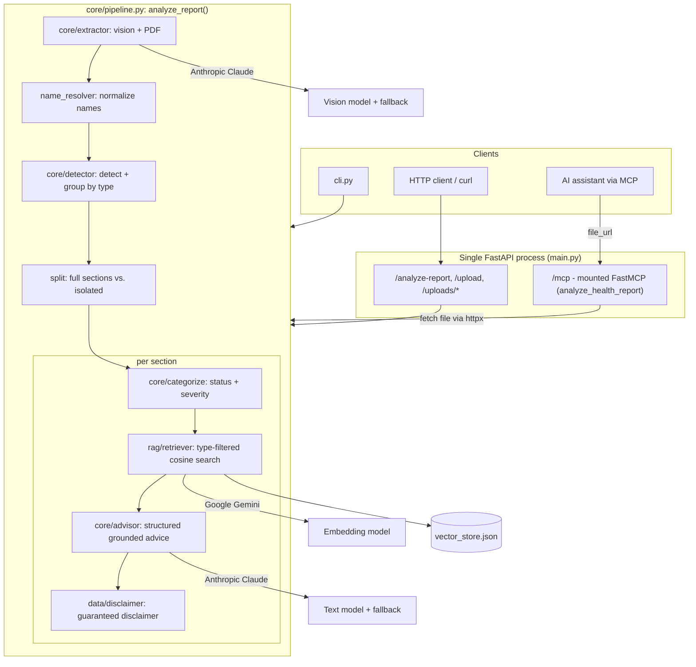

# ARCHITECTURE.md

How the system is structured and what calls what. For full context/stack see
`MASTER_CONTEXT.md`; for *why* each choice was made see `docs/DECISIONS.md`; for the
live status see `CURRENT_STATUS.md`.

---

## 1. Overview

A single Python (FastAPI) process exposes the same core pipeline three ways: a direct
HTTP API, static upload serving, and an **MCP tool** (for AI assistants), with the MCP
server mounted *inside* the FastAPI app so one process/port/tunnel covers everything.

The core pipeline is a linear-per-section flow: **extract → normalize → group → (per
section) categorize → retrieve → advise → disclaimer**. Deterministic work
(normalization, grouping, categorization) is plain Python; only extraction and advice
are LLM calls, and only retrieval uses embeddings.

Library code is organized into packages (`core`, `rag`, `data`, `utils`); entry-point
scripts (`main.py`, `cli.py`, `build_vector_store.py`) stay at the project root. Imports
are absolute-from-root. The app must be run from the project root (the reference-data
path is working-directory-relative).

## 2. Diagram



> LLM calls: extraction (Claude vision) and advice (Claude text). Embeddings: Gemini.
> Everything else is deterministic Python.

## 3. Components

### `main.py` (FastAPI app)
- HTTP entry point and MCP host. Endpoints: `/analyze-report`, `/upload`, static
  `/uploads/...`. Builds the MCP sub-app, wires its lifespan into the parent app at
  creation time, mounts it at `/mcp`. CORS wide open (dev only). Depends on
  `core.pipeline.analyze_report`.

### `cli.py` (entry point)
- Command-line runner: `python3 cli.py [file]` (defaults to `sample_report.png`). Calls
  `analyze_report` and prints each section's findings, advice, disclaimer, and any
  skipped pages.

### `core/pipeline.py` — `analyze_report(file_path, sex=None)`
- The single reusable entry point. Orchestrates: extract → normalize → group → split
  into sections → build each section → return `{sections, skipped_pages}`. Contains the
  section-splitting logic (`SECTION_THRESHOLD`) and the section builders
  (`_build_section`, `_build_isolated_section`). Reads `MOCK_AI` to decide mock vs. real.

### `core/extractor.py`
- Vision extraction. `extract_biomarkers()` base64-encodes the image, sends it to Claude
  as an image content block with a JSON-only prompt (requesting sex + per-marker
  value/unit/printed_range), parses with the shared fence-tolerant JSON helper, and
  returns `(biomarkers, sex)`. Only `"male"/"female"` are accepted for sex; else `None`.
  `_extract_biomarkers_from_pdf()` renders each PDF page (PyMuPDF), extracts, merges,
  takes the first sex found, skips unreadable pages (recording their numbers), and
  returns `(merged, skipped_pages, sex)`. Vision uses a model fallback chain.

### `core/detector.py`
- `detect_report_type()` (signature-marker set intersection; `"unknown"` if no confident
  match) and `group_markers_by_type()` (looks up each marker's type from
  `report_data.json`; unknown markers → an `"unknown"` group). Deterministic, no LLM.

### `core/categorize.py`
- Rule-based status + uniform severity. Three marker kinds: **range** (Low/Normal/High),
  **direction** (one-sided), **bands** (named tiers). Severity ∈
  normal/attention/critical/unassessed. Prefers the report's printed range over built-in
  ranges for range markers (records `range_source`); applies sex-specific variants when
  sex is known and no printed range is used; escalates to `critical` past critical
  thresholds. Loads `data/report_data.json`.

### `core/advisor.py`
- RAG advice. Filters findings to abnormal (severity == attention or higher), retrieves
  per-finding type-filtered context, prompts Claude for structured JSON
  `{summary, findings:[{name, advice}]}` grounded only in the retrieved context
  (non-diagnostic, no meds/dosages), parses with the shared helper, and degrades to
  summary-only on parse failure. Text model fallback via `call_model_with_fallback()`.

### `rag/` (knowledge base + retrieval)
- `load_articles.py` reads `articles/<type>/*.md`, tagging each with its type.
- `chunker.py` splits into overlapping word chunks.
- `embedder.py` embeds text via Gemini (retry; no fallback model — a known gap).
- `retriever.py` loads the vector store and does cosine search, **hard-filtered to the
  given report type**; returns nothing if no chunk matches (caller falls back to generic
  guidance).
- `build_vector_store.py` (root entry point) chains load → chunk → embed → writes
  `vector_store.json` with a `type` tag per chunk.

### `data/`
- `report_data.json` — per-type markers, ranges, sex variants, aliases, disclaimers,
  critical thresholds (illustrative, pending review).
- `disclaimer.py` — `get_disclaimer(report_type, has_critical)`: critical disclaimer if a
  critical finding is present, else the type's own, else the shared default.
- `mock_data.py` — per-type canned biomarkers + structured advice for `MOCK_AI`.

### `utils/`
- `json_utils.py` — `extract_json()`: tolerates markdown code fences / surrounding prose
  that models add despite instructions; shared by extraction and advice.
- `pdf_utils.py` — `pdf_to_images()`: renders PDF pages to PNGs (PyMuPDF).

### `mcp_server/server.py`
- FastMCP tool `analyze_health_report(file_url)`. Resolves a relative `/uploads/...` URL
  against `BACKEND_API_URL`, fetches the file via httpx (preserving extension so PDFs
  route correctly), writes a temp file, calls the same `analyze_report()`, and always
  deletes the temp file. Mounted into `main.py`.

## 4. Request / execution flows

### Flow A — HTTP / CLI
```
Client provides an image or PDF
 ↓ analyze_report(file_path, sex=None)
 ↓ extract (vision; PDF pages merged, bad pages skipped) -> biomarkers + sex
 ↓ normalize names -> group by type -> split into sections
 ↓ per section: categorize -> type-filtered retrieve -> advise -> disclaimer
 ↓ return {sections, skipped_pages}  (HTTP: JSON, or 400/500)
```

### Flow B — MCP
```
AI assistant calls analyze_health_report(file_url)
 ↓ tool fetches the file itself via httpx (image or PDF)
 ↓ temp file -> analyze_report(...)  (same function as Flow A)
 ↓ temp file deleted -> sections result returned
```

### Flow C — Vision extraction detail (core/extractor)
```
Read file -> (PDF: render each page to PNG) -> base64
 ↓ try each model in the fallback chain, 30s timeout:
     claude-sonnet-4-5 -> claude-haiku-4-5
 ↓ prompt: "respond with ONLY JSON", sex + per-marker {value, unit, printed_range}
 ↓ defensive empty-check -> extract_json (fence-tolerant) -> {sex, biomarkers}
 ↓ accept sex only if "male"/"female", else None
```

### Flow D — Per-section advice detail (core/advisor)
```
Filter the section's findings to abnormal (severity attention+)
 ↓ per abnormal finding: query "<name> is <status>", embed, cosine-search
   FILTERED to the section's report type, take top chunk(s)
 ↓ one prompt: findings summary + retrieved context + "use ONLY this, no diagnosis,
   no meds, recommend a doctor", request structured JSON
 ↓ text model via call_model_with_fallback() -> extract_json
 ↓ on parse failure: degrade to {summary: raw text, findings: []}
```

## 5. How the MCP server is mounted

```python
mcp_app = mcp_server_instance.http_app(path="/")
app = FastAPI(title="Health Report Analyzer API", lifespan=mcp_app.lifespan)  # wire lifespan here
app.mount("/mcp", mcp_app)
app.mount("/uploads", StaticFiles(directory="uploads"), name="uploads")
```
The sub-app's lifespan must be attached to the parent at creation time, or MCP session
handling breaks in ways not obviously connected to the missing hook. One process/port,
so a single ngrok tunnel covers the API, uploads, and MCP.

## 6. External integrations

- **Anthropic Claude** — vision extraction + advice generation (Anthropic SDK).
- **Google Gemini** — embeddings (`google-genai`). (Two providers because Anthropic has
  no embedding model.)
- **ngrok** — temporary public tunnel for remote MCP testing.
- **GitHub** — repo `health-report-analyzer`.
- ❓ No payment/email/analytics integrations.

## 7. Error handling

- **Vision extraction:** try/except per model attempt; defensive empty/invalid check;
  fence-tolerant JSON parse; falls through the model chain; raises the last error if all
  fail.
- **PDF pages:** each page in its own try/except — a failed page is skipped and reported
  in `skipped_pages`, not fatal. Temp page-images cleaned in `finally`.
- **Advice generation:** model fallback; **degrade-to-summary** if structured JSON can't
  be parsed (advice never lost).
- **Embeddings:** retry-with-backoff; no fallback model (known gap).
- **FastAPI endpoints:** wrap the pipeline in try/except → HTTP 500 with detail; temp
  uploads cleaned in `finally`.
- **Disclaimer:** guaranteed on every section in code, independent of model output.

## 8. Cross-cutting design principles

- **Rule-based where deterministic** (normalization, grouping, categorization) — LLMs
  only for genuinely open-ended work (DEC-003).
- **Resilience on every AI call** (retry + fallback + timeout + defensive validation) —
  DEC-011.
- **Data, not code** — reference data, aliases, variants, disclaimers live in JSON
  (DEC-020).
- **Guaranteed safety framing** — non-diagnostic, grounded-only, doctor-consult
  disclaimer enforced in code.
- **Consistent output shape** — always `{sections, skipped_pages}`, single- or
  multi-type.
- **Single responsibility per module; absolute-from-root imports; entry points at root.**

## 9. Known architectural limitations

- No MCP authentication (dev only); CORS wide open (dev only).
- No real deployment target — local + temporary tunnel only.
- Single process serves API, uploads, and MCP (a single point of failure).
- Local-JSON vector store; full regenerate on any article change; no incremental update.
- No fallback embedding model (unlike vision/text).
- Reference-data path is working-directory-relative (must run from project root).
- Medical reference data is hand-maintained and AI-drafted (pending review).

## 10. Potential future improvements

> Discussed ideas; see `docs/SPRINT_BOARD.md`.

- Narrative/radiology report support (gated on the medical-review decision).
- Real MCP auth; a real deployment target; tighter CORS; observability.
- A dedicated vector DB if the knowledge base grows large; a fallback embedding model.
- An evaluation harness for extraction/advice quality across types.
- `requirements.txt` for reproducible setup.
